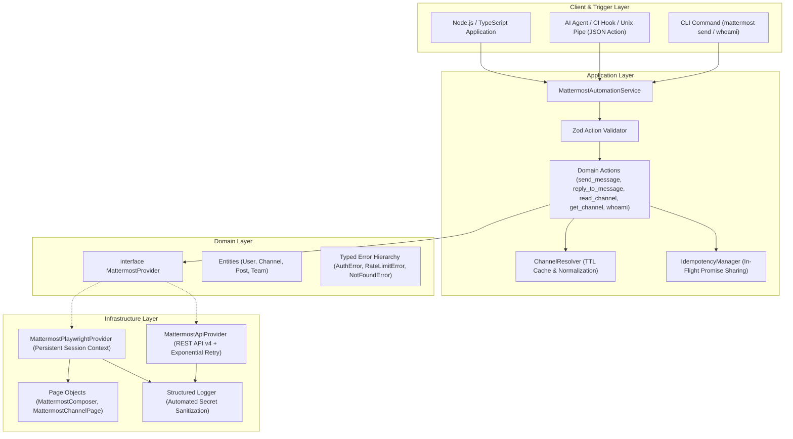

<div align="center">

# Mattermost Personal Account Automation

**Production-grade, modular automation service and CLI for interacting with Mattermost using your personal identity.**

[](https://www.typescriptlang.org/)
[](https://nodejs.org/)
[](https://vitest.dev/)
[](https://playwright.dev/)
[](https://opensource.org/licenses/MIT)

<p align="center">
  <a href="#-why-this-exists">Why This Exists</a> •
  <a href="#-architecture">Architecture</a> •
  <a href="#-features">Features</a> •
  <a href="#-quick-start">Quick Start</a> •
  <a href="#-yaml-channel-mapping">Channel Mapping</a> •
  <a href="#-cli-reference">CLI Reference</a> •
  <a href="#-typescript-sdk">TypeScript SDK</a> •
  <a href="#-security">Security</a> •
  <a href="#-testing">Testing</a>
</p>

</div>

---

## 💡 Why This Exists

Most Mattermost automation tools rely on **Incoming Webhooks**, **Bot Accounts**, or separate administrative identities. In enterprise engineering teams, this presents several problems:

1. **Identity Attribution**: Notifications, MR updates, and QA triggers appear as generic bots rather than from the engineer who actually triggered them.
2. **Permission & Audit Friction**: Setting up bots or incoming webhooks often requires workspace administrator privileges.
3. **Workflow Fragmentation**: Developers cannot easily integrate local CI/Git hooks with their real corporate Mattermost identity.

**Mattermost Personal Account Automation** solves this by providing a clean, modular abstraction layer that performs actions directly under your personal account using:
* **Strategy 1 (Primary)**: Mattermost REST API v4 with Personal Access Tokens (PAT).
* **Strategy 2 (Fallback)**: Resilient Playwright browser automation with persistent session contexts for organizations where PATs are restricted.

---

## 🏗 Architecture

The system enforces strict separation of concerns across Domain, Infrastructure, Application, and Client layers:



---

## ✨ Features

| Feature | Description |
| :--- | :--- |
| **Personal Account Attribution** | All posts, replies, and channel operations are attributed to your personal account. |
| **Dual Provider Support** | Switch seamlessly between REST API v4 (`api`) and Persistent Browser (`playwright`) without touching application code. |
| **Smart Channel Resolution** | Accepts channel names (`engineering`), slugs (`~engineering`), display names (`Engineering Team`), or 26-char IDs with in-memory TTL caching. |
| **Idempotency & Deduplication** | In-flight execution lock and cached response store prevents duplicate messages during retry storms. |
| **Identity Verification Lock** | Startup self-check verifies identity against `MATTERMOST_EXPECTED_USER_ID` or username, preventing unintended execution. |
| **Zero Credential Leaks** | Automated regex scrubbing masks Bearer tokens, cookies, passwords, and session data in logs, errors, and CLI outputs. |
| **AI Agent / CLI Integration** | Native JSON action interface supporting standard Unix pipes (`echo '{...}' \| mattermost action`). |
| **Type-Safe Domain Actions** | Runtime payload validation powered by Zod with descriptive typed errors and retry classification. |

---

## 🚀 Quick Start

### 1. Prerequisites
- **Node.js**: `v18.0.0` or higher
- **npm**, **pnpm**, or **bun**

### 2. Installation
Clone the repository and install dependencies:
```bash
git clone https://github.com/egagofur/Mattermost-Agent.git
cd Mattermost-Agent
npm install
```

### 3. Configuration
Copy `.env.example` to `.env`:
```bash
cp .env.example .env
```

Set your configuration in `.env`:
```env
# Mattermost Base URL
MATTERMOST_URL=https://mattermost.example.com

# Provider: 'api' (default) or 'playwright'
MATTERMOST_PROVIDER=api

# API Authentication (Required for 'api' provider)
MATTERMOST_TOKEN=your_personal_access_token_here

# Optional Team Context
MATTERMOST_TEAM_ID=
MATTERMOST_TEAM_NAME=

# Optional Identity Verification Lock
MATTERMOST_EXPECTED_USER_ID=
MATTERMOST_EXPECTED_USERNAME=

# Playwright Settings (Used if MATTERMOST_PROVIDER=playwright)
MATTERMOST_BROWSER_PROFILE_DIR=./data/mattermost-browser
MATTERMOST_HEADLESS=true

# Logging Level: debug, info, warn, error
LOG_LEVEL=info
```

---

## 🔑 Authentication Setup

### Strategy 1 — Personal Access Token (API Provider)
1. Log in to Mattermost in your browser.
2. Go to **Settings** $\rightarrow$ **Security** $\rightarrow$ **Personal Access Tokens**.
3. Click **Create Token**, give it a description, and copy the generated token.
4. Set `MATTERMOST_TOKEN=<your_token>` in `.env`.

### Strategy 2 — Persistent Browser Session (Playwright Provider)
If your Mattermost workspace administrator disables Personal Access Tokens:
1. Set `MATTERMOST_PROVIDER=playwright` in `.env`.
2. Run the interactive setup command:
   ```bash
   npm run cli -- login
   ```
3. A browser window will open. Complete your standard login and MFA manually.
4. Once logged in, the session is saved to `data/mattermost-browser/` and will be reused automatically for headless execution.

---

## 📁 YAML Channel Mapping

Define domain-friendly aliases, multi-team routing, and environment overlays in a `channels.yml` file (or `channels.yaml`).

### Example `channels.yml`
```yaml
default_team: engineering-team
fallback_channel: town-square

channels:
  # Simple string mapping
  eng: engineering
  general: town-square

  # Rich object mapping with target channel, team, and description
  backend-dev:
    channel: dotify-backend-dev
    team: dot-dev
    description: "Backend development notifications"

  qa-alerts:
    channel: automated-qa-reports
    team: quality-assurance
    description: "QA pipeline test results"

# Environment overlays (activated via MATTERMOST_ENV or --env)
environments:
  prod:
    backend-dev:
      channel: dotify-backend-prod
      team: dot-prod
```

### Inspecting Aliases
View all loaded channel aliases via CLI:
```bash
npm run cli -- aliases --channels-config channels.example.yml
```
```text
📋 Configured Channel Aliases (7 aliases):
   Default Team: engineering-team
   Fallback Channel: #town-square
-------------------------------------------------------------
   • eng              ➔ #engineering (team: engineering-team)
   • general          ➔ #town-square (team: engineering-team)
   • backend-dev      ➔ #dotify-backend-dev (team: dot-dev) - Backend development notifications
   • qa-alerts        ➔ #automated-qa-reports (team: quality-assurance) - QA pipeline test results
-------------------------------------------------------------
```

---

## 💻 CLI Reference

Run via `npm run cli -- <command>` or link globally using `npm link`:

```text
Usage: mattermost [options] [command]

Options:
  -V, --version                Output the version number
  --json                       Output results in structured JSON format
  -u, --url <url>              Mattermost server URL override
  -t, --token <token>          Personal Access Token override
  -p, --provider <provider>    Provider override ("api" | "playwright")
  --team-id <teamId>           Team ID override
  -h, --help                   Display help for command

Commands:
  whoami                       Verify personal identity and display current account
  send [options]               Send a message to a channel
  reply [options]              Reply to a message thread
  channel [options] <channel>  Look up and resolve a channel by name or ID
  read [options] <channel>     Read recent messages from a channel
  action [jsonPayload]         Execute a domain action via JSON string or stdin
  login                        Open browser for one-time manual login (Playwright)
```

### Examples

#### Verify Authenticated Identity
```bash
npm run cli -- whoami
```
```text
✅ Mattermost Identity Verified
   User ID:   7x8y9z1234567890abcdef1234
   Username:  egagofur
   Name:      Ega Gofur
   Email:     ega@example.com
   Roles:     system_user
```

#### Send a Message to a Channel
```bash
npm run cli -- send --channel engineering --message "MR !456 is ready for review."
```

#### Reply to a Thread
```bash
npm run cli -- reply --channel engineering --root-id post_789abc --message "Tests passed successfully on staging."
```

#### Inspect Channel Details
```bash
npm run cli -- channel engineering
```

#### Read Recent Channel Posts
```bash
npm run cli -- read engineering --limit 5
```

#### Direct JSON Action / AI Agent Pipe
```bash
echo '{"action":"send_message","channel":"engineering","message":"Automated deployment completed."}' | npm run cli -- action
```
JSON Response:
```json
{
  "success": true,
  "data": {
    "id": "post_123456789",
    "channelId": "chan_engineering_id",
    "userId": "usr_egagofur",
    "message": "Automated deployment completed.",
    "createdAt": "2026-08-24T10:45:00.000Z"
  }
}
```

---

## 📦 TypeScript SDK Usage

Integrate Mattermost personal account automation directly into your Node.js/TypeScript services:

```typescript
import { MattermostAutomationService, loadConfig } from 'mattermost-agent';

async function main() {
  // 1. Initialize service with environment or custom config
  const service = new MattermostAutomationService();

  // 2. Startup identity check (optional fail-fast)
  const me = await service.whoami();
  console.log(`Authenticated as @${me.username} (${me.id})`);

  // 3. Post a message to a channel (resolves name automatically)
  const post = await service.sendMessage({
    channel: 'engineering',
    message: '🚀 CI Build #120 passed all integration tests.',
  });
  console.log(`Message sent: ${post.id}`);

  // 4. Reply to the created thread
  await service.replyToMessage({
    channel: 'engineering',
    rootId: post.id,
    message: 'Artifacts available at: https://ci.example.com/build/120',
  });

  // 5. Read recent posts from a channel
  const { channel, messages } = await service.readChannel({
    channel: 'engineering',
    limit: 10,
  });
  console.log(`Read ${messages.length} messages from #${channel.displayName}`);

  // 6. Execute structured domain action (AI agent / webhook format)
  const actionResult = await service.executeAction({
    action: 'send_message',
    channel: 'engineering',
    message: 'Triggered from agent workflow.',
    idempotencyKey: 'event-unique-id-9988',
  });

  if (actionResult.success) {
    console.log('Action success:', actionResult.data);
  } else {
    console.error(`Action failed [${actionResult.error?.code}]: ${actionResult.error?.message}`);
  }

  // 7. Cleanup
  await service.close();
}

main().catch(console.error);
```

---

## 🛡 Security & Privacy Principles

1. **Zero Secret Logging**: Tokens, Bearer headers, session cookies, and passwords are automatically redacted by the logger and error formatting layer before output.
2. **No Password Storage**: The system never asks for, stores, or automates password inputs.
3. **Session Isolation**: Playwright browser profile files (`data/mattermost-browser/`) and `.env` configuration files are explicitly ignored in `.gitignore`.
4. **Idempotent Retries**: Network retries are only performed for transient errors (e.g. `502`, `503`, `429`, timeout) with exponential backoff and jitter, preventing duplicate post spam.
5. **Identity Guard**: Optional `MATTERMOST_EXPECTED_USER_ID` or `MATTERMOST_EXPECTED_USERNAME` prevents the automation from executing if the active credentials belong to an unexpected account.

---

## 🧪 Testing

The codebase includes a test suite covering configuration parsing, action schemas, channel resolution, idempotency locks, API client status mapping, and browser provider fallbacks.

```bash
# Run all unit and integration tests
npm test

# Run tests in watch mode
npm run test:watch

# Run TypeScript typecheck
npm run typecheck

# Build distribution bundle
npm run build
```

---

## 📄 License

This project is licensed under the [MIT License](LICENSE).
